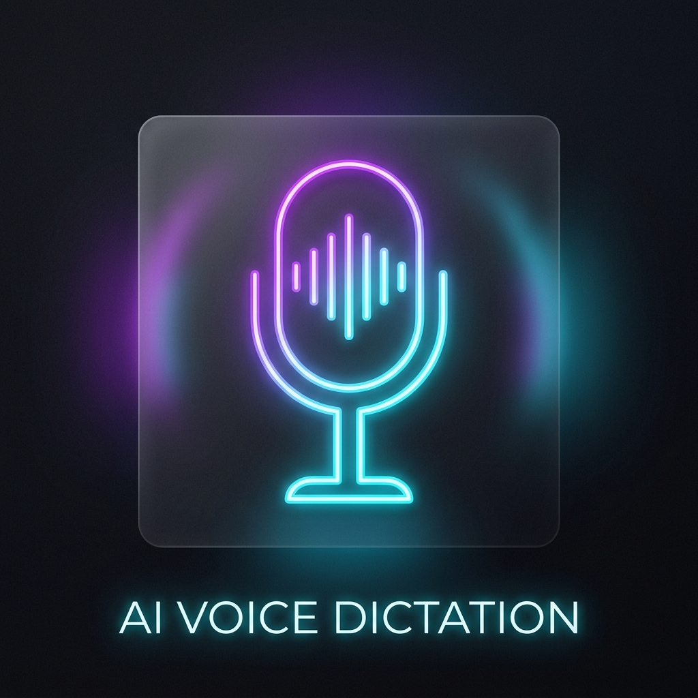

<div align="center">
  
  <br><br>
  
  
  
  
  

  <h1>🎤 Whisper Key / Beautiful STT Overlay</h1>
  <p><strong>A premium, lightning-fast Speech-To-Text floating widget for Windows.</strong></p>
  <p><i>Стильный, молниеносный виджет диктовки (Голос-в-Текст) для Windows с невероятно плавными современными анимациями.</i></p>
</div>

<hr>

## 🌟 About The Project / О проекте

**Whisper Key** is a beautiful, global overlay application that brings a premium, seamless dictation experience to the Windows ecosystem. Built for professionals, writers, and power users, it completely bypasses the clunky default Windows dictation tools. Simply hold a hotkey (`Ctrl + Win`), speak naturally into your microphone, and watch as your voice is instantly transcribed and pasted into your active application.

**Whisper Key** — это премиальный глобальный виджет, который переносит современную эстетику и абсолютное удобство голосового ввода на Windows. Проект создан для тех, кому важна скорость, красота и полная приватность. Просто зажмите горячую клавишу (`Ctrl + Win`), говорите естественным языком, и ваш текст будет моментально расшифрован и вставлен в любую активную программу, где сейчас стоит курсор (будь то Word, Telegram или браузер).

*(Place your screenshot here / Замените это на свой скриншот: ``)*

---

## ✨ Features / Ключевые возможности

- 🚀 **Lightning Fast:** Uses `faster-whisper` and CTranslate2 for ultra-fast, near real-time transcription on your GPU.
- 🎨 **Beautiful UI:** Features a stunning 60-FPS mathematically accurate audio waveform (oscillograph) built with Electron and HTML5 Canvas. The glassmorphic transparency perfectly blends with the Windows 11 Fluent design.
- 🌍 **Multi-language Support:** Excellent out-of-the-box transcription for Russian and English.
- ⌨️ **Global Hotkeys:** Works globally anywhere in Windows. Press `Ctrl + Win` to speak, release to paste.
- 🔒 **100% Offline & Private:** All AI models run locally on your machine. Your voice is never sent to the cloud.

---

## 🧠 AI Models & Automation / Модели ИИ и Автоматизация

Whisper Key is designed to be **fully automated ("plug and play")**. You do not need to manually download weights, configure punctuation models, or map text outputs.

### 🤖 How Automation Works / Как работает автоматизация
1. **Auto-Download:** Upon first launch, the application automatically connects to Hugging Face and downloads the highly optimized CTranslate2 model weights directly to your local cache (`~/.cache/huggingface/hub/`). 
2. **Auto-Punctuation:** Whisper naturally predicts punctuation (commas, periods, question marks) and capitalization directly from the audio context. No separate "punctuation models" are required.
3. **Auto-Type:** Once you release the hotkey, the text is instantly placed into your clipboard and automatically pasted (via `Ctrl+V` simulation) into whatever window you currently have open.

### 📦 Included Models / Доступные модели
You can switch between these models in the settings depending on your needs:
1. **`large-v3-turbo`** (Recommended) — The absolute best balance between speed and extreme accuracy for multiple languages (including English and Russian). Requires ~1.5 GB of free disk space.
2. **`zipformer.small.ru`** (Sherpa-ONNX) — Specialized, lightning-fast streaming model strictly for the Russian language. Extremely lightweight.

---

## 🛠 Architecture & Tech Stack / Архитектура

We chose a unique hybrid architecture to get the best of both worlds: Heavy AI processing in Python, and silky smooth 60-FPS animations in a web renderer.

* **Backend Engine (Python):** Handles the audio recording (`pyaudio`), hotkey listening (`pynput`), and AI transcription (`faster-whisper` / `CTranslate2`).
* **Frontend GUI (Electron.js):** A completely transparent, frameless, and click-through window that renders the stunning neon wave using raw HTML5 `Canvas` and complex math (bell-curve attenuation for organic flow).
* **IPC (Inter-Process Communication):** High-performance Local TCP Sockets ensure zero latency between your voice volume changes and the UI waveform reacting to it.

---

## 📥 Installation / Установка

### Prerequisites / Требования
* Windows 10 or Windows 11 (Windows 11 recommended for perfect blur effects)
* Node.js (for the Electron UI)
* Python 3.10+ 
* Optional but highly recommended: NVIDIA GPU (CUDA) for instant transcription

### Setup for Developers / Настройка для разработчиков

1. **Clone the repo / Скачайте репозиторий:**
   ```bash
   git clone https://github.com/RandoTeam/whisper-key.git
   cd whisper-key
   ```

2. **Install Python dependencies / Установите зависимости Python:**
   ```bash
   pip install .
   ```

3. **Install GUI dependencies & Run / Установите зависимости GUI и запустите:**
   ```bash
   # Navigate to the GUI folder and install node packages
   cd src/whisper_key/gui_electron
   npm install
   
   # Go back to the root and run the app
   cd ../../../
   python -m src.whisper_key.main
   ```

---

## 💖 Support the Project / Поддержать проект (Donate)

This project is developed open-source. Donations are completely optional, but they greatly help cover development time, local model experiments, and continuous UI improvements!

*Этот проект разрабатывается на энтузиазме. Донаты абсолютно добровольны, но они очень помогают оплачивать время на разработку, эксперименты с нейросетями и улучшение дизайна! Если вам нравится Whisper Key, угостите разработчика кофе:*

| Currency / Валюта | Network / Сеть | Address / Кошелек |
|---|---|---|
| **Bitcoin (BTC)** | Bitcoin | `bc1qd5s9dwvyvlv320ynluk66zpd0p24knzxrjzwvr` |
| **Ethereum (ETH)** | Ethereum | `0xfca2fc261d4f23768a04ec49c3448278cdf17c2b` |
| **Tether (USDT)** | Ethereum ERC-20 | `0xfca2fc261d4f23768a04ec49c3448278cdf17c2b` |
| **USD Coin (USDC)**| Ethereum ERC-20 | `0xfca2fc261d4f23768a04ec49c3448278cdf17c2b` |

*Please verify the exact asset and network before sending funds. Thank you for your support!*

---

## 👨‍💻 Authors / Авторы

* **RandoTeam** — Lead Developer & Maintainer (GUI redesign, architecture, packaging)
* Original `Whisper` by OpenAI
* `faster-whisper` by SYSTRAN

---

## 📜 License / Лицензия

Distributed under the **MIT License**. See `LICENSE` for more information.

*This project utilizes `faster-whisper` by SYSTRAN, `CTranslate2` by OpenNMT, and the original `Whisper` model by OpenAI, all of which are open-source under the MIT License.*
